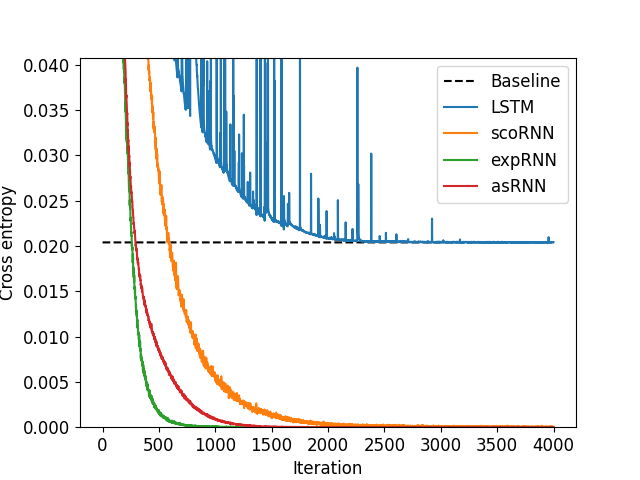
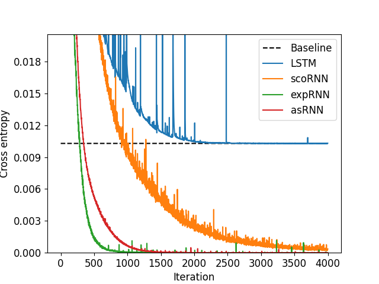

# README

# Adaptive-saturated RNN: Remember more with less instability

This repository hosts the PyTorch code to implement the paper: [Adaptive-saturated RNN: Remember more with less instability](https://openreview.net/forum?id=FFpyxQXMksb)

If you find the paper or the source code useful, please consider about supporting our works by citing [bibtex](this will be updated upon acceptance): [this will be updated upon acceptance]

## Abstract

Orthogonal parameterization has offered a compelling solution to the vanishing gradient problem (VGP) in recurrent neural networks (RNNs). Thanks to orthogonal parameters and non-saturated activation functions, gradients in such models are constrained to unit norms. On the other hand, although the traditional vanilla RNN have been observed to possess higher memory capacity, they suffer from the VGP and perform badly in many applications. This work connects the aforementioned approaches by proposing Adaptive-Saturated RNNs (asRNN), a variant that dynamically adjusts the saturation level between the two. Consequently, asRNN enjoys both the capacity of a vanilla RNN and the training stability of orthogonal RNNs. Our experiments show encouraging results of asRNN on challenging sequence learning benchmarks compared to several strong competitors.

## Model Architecture

*Formulation* We formally define the hidden cell of asRNN as:
$h_t = W_f^{-1}\mathrm{tanh}(W_f(W_{xh}x_{t}+W_{hh}h_{t-1} + b)),$
where $W_f = U_fD_f$, $U_f$ and $W_{hh}$ are parametrized orthogonal according to the [expRNN](https://arxiv.org/abs/1901.08428) paper, and $D_f$ is strictly positive diagonal.

- Details of the implementation can be found in Appendix A.4 of our paper.
- Details of the hyperparameter setting can be found in [Hyperparameter.md](Hyperparameter.md)

## Usage

**Linux environment variable:**

```bash
export 'CUBLAS_WORKSPACE_CONFIG=:4096:8'
echo $CUBLAS_WORKSPACE_CONFIG
```

### Copytask

```
python copytask.py [args]
```

**Options:**

- recall_length
- delay_length
- random-seed
- iterations
- batch_size
- hidden_size
- rmsprop_lr: learning rate
- rmsprop_constr_lr: learning rate of $W_{hh}$
- alpha : rmsprop smoothing constant
- clip_norm: norm threshold for gradient clipping. Set negative to disable.
- mode: choices=["exprnn", "dtriv", "cayley", "lstm", "rnn"] (see [https://github.com/Lezcano/expRNN](https://github.com/Lezcano/expRNN))
- init: choices=["cayley", "henaff"] - $\ln(W_{hh})$ initialization scheme
- nonlinear: choices=["asrnn", "modrelu"]
- a: asRNN hyperparameter
- b: asRNN hyperparameter
- eps: asRNN hyperparameter
- rho_rat_den: $\frac{1}{\rho}$, a hyperparameter for scoRNN.
- forget_bias
- K: see [here](https://github.com/Lezcano/expRNN)

### MNIST

```bash
python MNIST.py [args]
```

**Options:**

- permute: True or False (pMNIST or sMNIST).
- random-seed
- epochs
- batch_size
- hidden_size
- rmsprop_lr: learning rate
- rmsprop_constr_lr: learning rate of $W_{hh}$
- alpha : rmsprop smoothing constant
- clip_norm: norm threshold for gradient clipping. Set negative to disable.
- mode: choices=["exprnn", "dtriv", "cayley", "lstm", "rnn"] (see [https://github.com/Lezcano/expRNN](https://github.com/Lezcano/expRNN))
- init: choices=["cayley", "henaff"] - $\ln(W_{hh})$ initialization scheme
- nonlinear: choices=["asrnn", "modrelu"]
- a: asRNN hyperparameter
- b: asRNN hyperparameter
- eps: asRNN hyperparameter
- rho_rat_den: $\frac{1}{\rho}$, a hyperparameter for scoRNN.
- forget_bias
- K: see [here](https://github.com/Lezcano/expRNN)

### PTB

**Prepare the dataset:**

- Download the dataset [here](http://www.fit.vutbr.cz/~imikolov/rnnlm/simple-examples.tgz)
- Extract 'ptb.char.train.txt’, 'ptb.char.valid.txt’, 'ptb.char.test.txt’ from ./simple-examples/data into ./Dataset/PTB

```bash
python pennchar.py [args]
```

**Options:**

- bptt: back propagation through time length
- emsize: size of word embedding
- log-interval: report batch interval
- epochs: number of iterations
- batch_size
- hidden_size
- rmsprop_lr: learning rate
- rmsprop_constr_lr: learning rate of $W_{hh}$
- alpha : rmsprop smoothing constant
- clip_norm: norm threshold for gradient clipping. Set negative to disable.
- mode: choices=["exprnn", "dtriv", "cayley", "lstm", "rnn"] (see [https://github.com/Lezcano/expRNN](https://github.com/Lezcano/expRNN))
- init: choices=["cayley", "henaff"] - $\ln(W_{hh})$ initialization scheme
- nonlinear: choices=["asrnn", "modrelu"]
- a: asRNN hyperparameter
- b: asRNN hyperparameter
- eps: asRNN hyperparameter
- rho_rat_den: $\frac{1}{\rho}$, a hyperparameter for scoRNN.
- forget_bias
- K: see [here](https://github.com/Lezcano/expRNN)

# Experiment Results

## Best test accuracy on pixelated MNIST tasks

| Model | #PARAMS | hidden_size | sMNIST | pMNIST |
| --- | --- | --- | --- | --- |
| asRNN | $16\times10^3$ | $122$ | $\bf98.89\%$ | $\bf95.41\%$ |
| expRNN | $16\times10^3$ | $170$ | $98.0\%$ | $94.9\%$ |
| scoRNN | $16\times10^3$ | $170$ | $97.2\%$ | $94.8\%$ |
| asRNN | $69\times10^3$ | $257$ | $\bf99.21\%$ | $\bf96.88\%$ |
| expRNN | $69\times10^3$ | $360$ | $98.4\%$ | $96.2\%$ |
| scoRNN | $69\times10^3$ | $360$ | $98.1\%$ | $95.9\%$ |
| LSTM | $69\times10^3$ | $128$ | $81.9\%$ | $79.5\%$ |
| asRNN | $137\times10^3$ | $364$ | $\bf99.3\%$ | $\bf96.96\%$ |
| expRNN | $137\times10^3$ | $512$ | $98.7\%$ | $96.6\%$ |
| scoRNN | $137\times10^3$ | $512$ | $98.2\%$ | $96.5\%$ |

## Training Cross Entropy on Copying Memory tasks



Recall Length $K =10$, Delay Length $L = 1000$.



Recall Length $K =10$, Delay Length $L = 2000$.

## Bit-per-character results on test set of Penn Treebank Character-level Prediction tasks

| Model | #PARAMS | hidden_size | $T_{BPTT}=150$ | $T_{BPTT}=300$ |
| --- | --- | --- | --- | --- |
| LSTM | $1.32\times10^6$ | $475$ | $\bf 1.41 \pm 0.005$ | $\bf 1.43\pm0.004$ |
| asRNN | $1.32\times10^6$ | $1024$ | $1.46 ± 0.006$ | $1.49 \pm 0.005$ |
| expRNN | $1.32\times10^6$ | $1386$ | $1.49\pm 0.008$ | $1.52 \pm 0.001$ |

## Acknowledgement:

[https://github.com/Lezcano/expRNN](https://github.com/Lezcano/expRNN)

[https://github.com/KyleGoyette/nnRNN](https://github.com/KyleGoyette/nnRNN)

## Next:

- Implement a Hyperparameter Tuner
